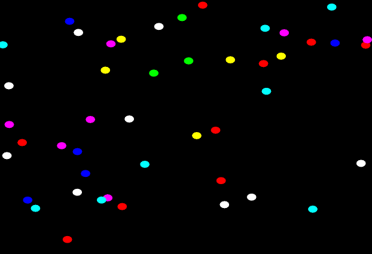

# WebGPU 2D Circle Collision Simulation 

Small project I did while learning Zig + Mach + WEBGPU. Leaving here in case it's useful to anyone.

## preview



## overview

The experiments consists of N circles in random positions & velocities. The collision is accelerated using compute shaders inspired by [this](https://github.com/DiligentGraphics/DiligentSamples) approach.

The hash grid constructed using two extra buffers: "circle_list" + "circle_head_list" - that simulate a linked list per grid cell. This approach only works for objects where grid is roughly the same as the biggest object. As all circles have the same radius, the grid cell width is 2 * radius.

## install

```
clone the repo
git submodule init (mach engine)
git submodule update
zig build run
```

## pipelines

- list_clean_compute.wgsl: reset the circle_head_list buffer (set -1 to all elements).
- list_compute.wgsl: computes the circle_head_list and circle_list buffers. The head of each linked list is set using an atomic exchange and the previous head is set in the appropriate index of circle_list_buffers.
- collision_compute.wgsl: checks a 3x3 grid around the grid cell of the circle and performs the collision.
- render.wgsl: simple drawing of vertex-indexed circles; the collors change depending on the number of collision of the circle.

## todo

The displacement of circles is a little odd. There's room to improve the collision itself as well...
